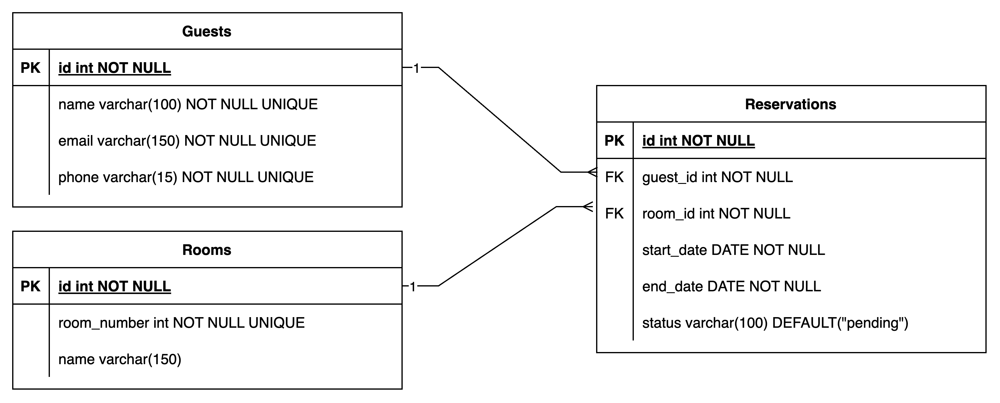

# Software Design Document (SDD)

## Hotel Reservation System

### Table of Contents
1. **Introduction**
   - Purpose
   - Scope
   - Definitions, Acronyms, and Abbreviations
2. **System Overview**
   - Features
   - High-Level Architecture
3. **Design Considerations**
   - Assumptions and Dependencies
   - Constraints
4. **System Architecture Design**
   - Database Design
   - Backend Architecture
   - Frontend Architecture
5. **Detailed Design**
   - Database Schema
   - API Endpoints
   - Frontend Components
6. **Deployment Design**
   - Deployment Plan
   - Docker Configuration
7. **Technology Stack**
8. **UI Wireframes**
9. **Appendices**
   - References

---

### 1. Introduction

#### Purpose
The purpose of this document is to outline the design of the Hotel Reservation System, which is intended to manage guest, room, and reservation data efficiently. The system ensures scalability, maintainability, and user-friendly functionality.

#### Scope
The Hotel Reservation System allows:
- Management of guests, rooms, and reservations.
- Booking and cancellation of reservations.
- Viewing detailed information about guests, rooms, and calendar views for reservations.

#### Definitions, Acronyms, and Abbreviations
- **API**: Application Programming Interface
- **CRUD**: Create, Read, Update, Delete
- **ERD**: Entity-Relationship Diagram
- **UX**: User Experience

---

### 2. System Overview

#### Features
1. **Guest Management**:
   - View, create, and edit guest information.
   - View past and upcoming reservations for each guest.

2. **Room Management**:
   - View, create, and edit room details.
   - Sort and paginate room listings.

3. **Reservation Management**:
   - View calendar of reservations.
   - Create and cancel reservations.
   - Prevent overlapping reservations through transactional locks.

#### High-Level Architecture
The system follows a three-tier architecture:
- **Frontend**: Angular with Taiga UI.
- **Backend**: Node.js with Express and TypeScript.
- **Database**: PostgreSQL for storing all data.

---

### 3. Design Considerations

#### Assumptions and Dependencies
- Angular will be used for frontend development.
- PostgreSQL is the primary database.
- Users will interact with the system via a web application.

#### Constraints
- Must use the defined technology stack.
- Ensure no overlapping reservations.
- Deliver the system within 7-10 days.

---

### 4. System Architecture Design

#### Database Design
##### Tables
- **Guests**: Manages guest details.
- **Rooms**: Stores room information.
- **Reservations**: Tracks guest bookings and room allocations.

#### Backend Architecture
- Layered architecture with:
  - **Routing Layer**: API endpoint handling.
  - **Business Logic Layer**: Validations and processing.
  - **Data Layer**: Database interaction through Knex.js.

#### Frontend Architecture
- Angular components for guest, room, and reservation management.
- Services to interact with backend APIs.
- Calendar view for reservations.

---

### 5. Detailed Design

#### Database Schema
- **Guests**:
  - `id` (Primary Key), `name`, `email`, `phone`, `created_at`, `updated_at`
- **Rooms**:
  - `id` (Primary Key), `room_number`, `name`, `created_at`, `updated_at`
- **Reservations**:
  - `id` (Primary Key), `guest_id` (Foreign Key), `room_id` (Foreign Key), `start_date`, `end_date`, `status`, `created_at`, `updated_at`

#### API Endpoints
1. **Guests**:
   - `GET /guests`: List guests (paginated).
   - `POST /guests`: Create a new guest.
   - `PUT /guests/:id`: Update guest details.
   - `GET /guests/:id`: View guest details.

2. **Rooms**:
   - `GET /rooms`: List rooms (paginated, sortable).
   - `POST /rooms`: Create a new room.
   - `PUT /rooms/:id`: Update room details.
   - `GET /rooms/:id`: View room details.

3. **Reservations**:
   - `GET /reservations`: List reservations (paginated).
   - `POST /reservations`: Create a reservation.
   - `DELETE /reservations/:id`: Cancel a reservation.
   - `GET /reservations/calendar`: View reservation calendar.

#### Frontend Components
1. **Guest Management**:
   - Guest List Component.
   - Guest Details Component.

2. **Room Management**:
   - Room List Component.
   - Room Details Component.

3. **Reservation Management**:
   - Reservation Calendar Component.
   - Reservation Form Component.

---

### 6. Deployment Design

#### Deployment Plan
1. Write Dockerfiles for both frontend and backend.
2. Set up `docker-compose` to orchestrate API, frontend, and PostgreSQL.

#### Docker Configuration
- Frontend Dockerfile:
  - Use Node.js to build Angular app and serve with NGINX.
- Backend Dockerfile:
  - Use Node.js for the Express server.
- PostgreSQL:
  - Use the official PostgreSQL Docker image.

---

### 7. Technology Stack

#### Core Technology Stack
1. **Frontend**:
   - Angular with TypeScript for building user interfaces.
   - Taiga UI for component design.
   - Tailwind CSS (optional) for styling.

2. **Backend**:
   - Node.js with Express.js for handling API requests.
   - TypeScript for type safety and maintainability.
   - Knex.js for database queries and migration handling.

3. **Database**:
   - PostgreSQL as the primary relational database.

4. **Testing**:
   - Jest for writing and executing unit and integration tests.

5. **Version Control**:
   - Git for tracking changes and collaboration.
   - GitHub for repository hosting.

#### Bonus Technologies
1. **Typebox**:
   - For defining types and validations.
   - Used to ensure strong typing and avoid code duplication.

2. **Deployment**:
   - Docker and Docker Compose for containerized deployment.
   - NGINX as a reverse proxy to route frontend and backend requests behind a single domain.
   - Deployment to a live server (e.g., AWS, Azure, or DigitalOcean).

3. **Integration Testing**:
   - API integration tests using Jest to validate API responses and ensure system robustness.

---
### 8. UI Wireframes

This section contains wireframes for the main user interface elements of the system. These wireframes focus on the functionality and user experience design of the application.

#### Wireframe Details
1. **Guest List View**:
   - Displays a paginated list of all guests.
   - Provides options to view, edit, or delete guest details.

2. **Room List View**:
   - Shows a paginated list of all rooms with sorting options.
   - Includes details such as room name, number, and reservation statistics.

3. **Reservation Calendar View**:
   - Displays existing reservations in a calendar format.
   - Highlights busy days and allows users to navigate by month.

4. **Reservation Form**:
   - Provides an interface for creating reservations by selecting guests, rooms, and date ranges.
   - Includes validation for overlapping reservations and invalid dates.

5. **Guest Details Page**:
   - Shows a guest’s detailed information, including past and upcoming reservations.

Each wireframe will be illustrated in the appendices and linked to the corresponding UI functionality.

---
### 9. Appendices

#### References
1. [PostgreSQL Documentation](https://www.postgresql.org/docs/)
2. [Angular Documentation](https://angular.io/docs)
3. [Express.js Documentation](https://expressjs.com/)
4. [Knex.js Documentation](https://knexjs.org/)
